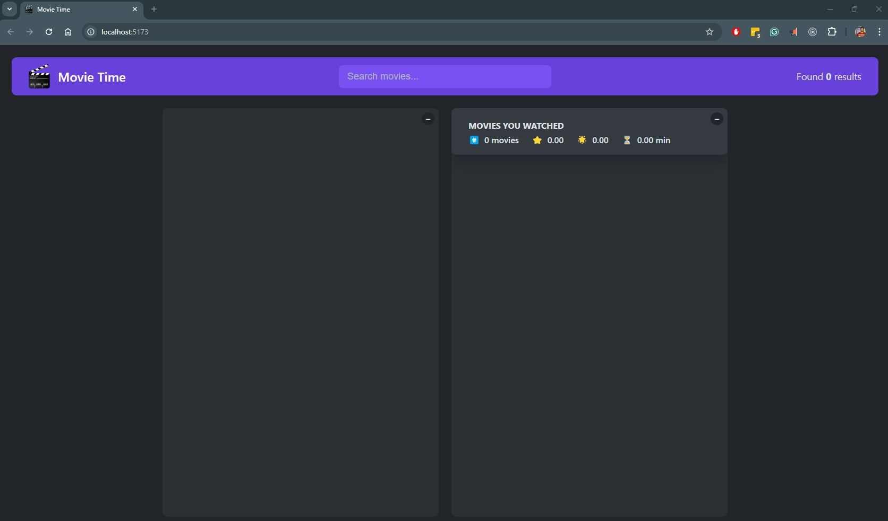
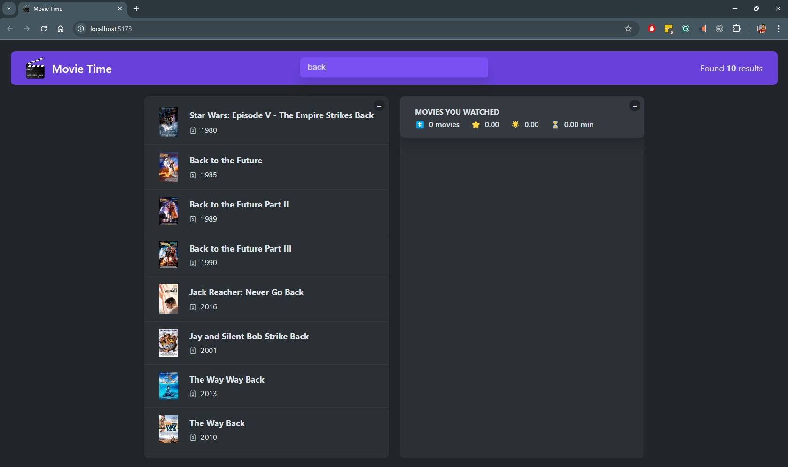
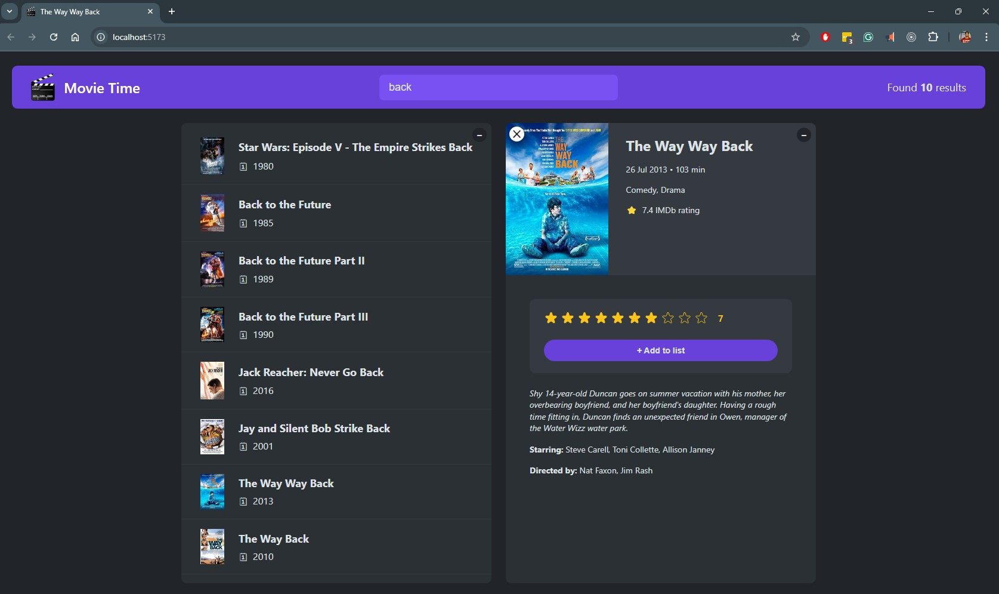
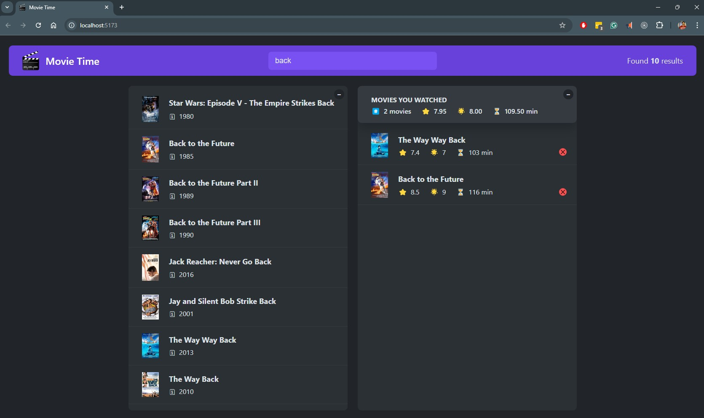
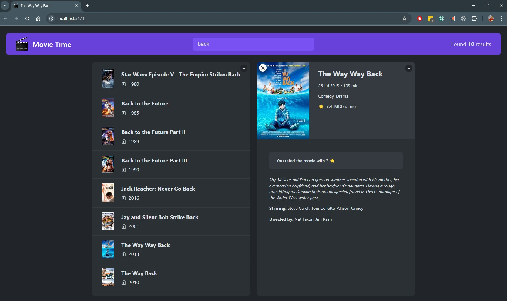

#  Movie Time App ( React + TypeScript + Vitest -    +  +  )

  A movie discovery web application built with **`React`** and **`TypeScript`** and tested using **`Vitest`**. The app allows users to search for movies, view movie details, and manage a list of watched movies, leveraging the OMDB API.

## Table of Contents

- [Demo](#demo)
- [Tech Stack](#tech-stack)
- [Features](#features)
- [Screenshots](#screenshots)
- [Installation](#installation)
- [Usage](#usage)
- [API](#api)
- [Concepts Covered](#concepts-covered)

## Demo

You can view a live demo of the app [here](https://charan-sanjay-movie-time.netlify.app/).

## Tech Stack

 +  +  + +  +  +  + 

- **React `^18.3.1`**: A JavaScript library for building user interfaces.
- **TypeScript**: A superset of JavaScript that adds static types.
- **Vitest**: Used for testing. Vitest is a modern testing framework built for Vite.
- **Vite**: A next-generation, fast build tool for modern web applications.
- **CSS 3**: Styles for the application.
- **JavaScript**: The primary language for logic and functionality.
- **Netlify**: Used for deploying the app

## Vite Configuration

This project uses **Vite** as the build tool. Vite provides an ultra-fast development environment and optimized production builds. Here are some highlights of how Vite is used in this project:

- **Development Server**: Vite's development server provides fast HMR (Hot Module Replacement), enabling a smooth and fast development experience.
- **Optimized Builds**: Vite optimizes the application for production using features like tree-shaking, lazy-loading, and ES module support.
- **Typescript Support**: Vite natively supports TypeScript, so you don’t need to configure additional TypeScript tooling.
  
To learn more about Vite and how to configure it further, check out the [Vite Documentation](https://vitejs.dev/).

## Features

- **Movie Search**: Search for movies by title using the OMDB API.
- **Movie Details**: View detailed information about movies, including title, release year, plot, actors, and more.
- **Rating System**: Users can rate movies on a 1-0 scale.
- **Watch List**: Add movies to a watched list.
- **Remove from Watch List**: Easily remove movies from the watched list.
- **Local Storage**: Movies in the watched list are saved to the browser's local storage to persist data between sessions.

## Screenshots

### 1. Main Screen

---


### 2. Movie Search Screen

---


### 3. Movie Details Screen

---


### 4. Rate a Movie

---


### 5. Watched movies list after rating

---


### 6. Rated Movie Details

---


## Installation

To run the project locally:

1. Clone the repository:

   ```bash
   git clone https://github.com/yourusername/movie-app.git
   ```

2. Navigate into the project directory:

   ```bash
   cd movie-app
   ```

3. Install the dependencies:

   ```bash
   npm install
   ```

4. Run the development server:

   ```bash
   npm run dev
   ```

5. Open the application in your browser at `http://localhost:3000`.

6. Run the tests:

   ```bash
   npm test
   ```

## Usage

Once the app is running, users can:

- Search for movies by title using the search bar.
- Click on a movie to view its details.
- Rate movies on a scale of 1 to 5.
- Add movies to their watch list.
- Remove movies from the watch list.
- The watched list is saved in local storage, so it persists between sessions.

## API

The application uses the OMDB API to fetch movie data. You can view the API documentation [here](https://www.omdbapi.com/).

### Example API request

```http
GET https://www.omdbapi.com/?apikey=YOUR_API_KEY&s=movieName
```

Replace `movieName` with the desired movie name, and `YOUR_API_KEY` with your actual API key.

## Concepts Covered

- **React + TypeScript**: Building user interfaces with TypeScript in React.
- **Component Composition**: Creating reusable components that can be composed to build larger UIs.
- **useState and useEffect Hooks**: Managing component state and side effects of the Application.
- **useMemo**: Optimized performance by preventing unnecessary recalculations on re-renders.
- **Custom Hooks**: Encapsulating reusable logic into custom hooks for better modularity.
- **Local Storage**: Storing data on the client side so that it persists across sessions.
- **Responsive Design**: Ensuring the application looks great on all screen sizes using CSS media queries.
- **Search Functionality**: Implementing efficient search functionality with debounced network requests to avoid race conditions.
